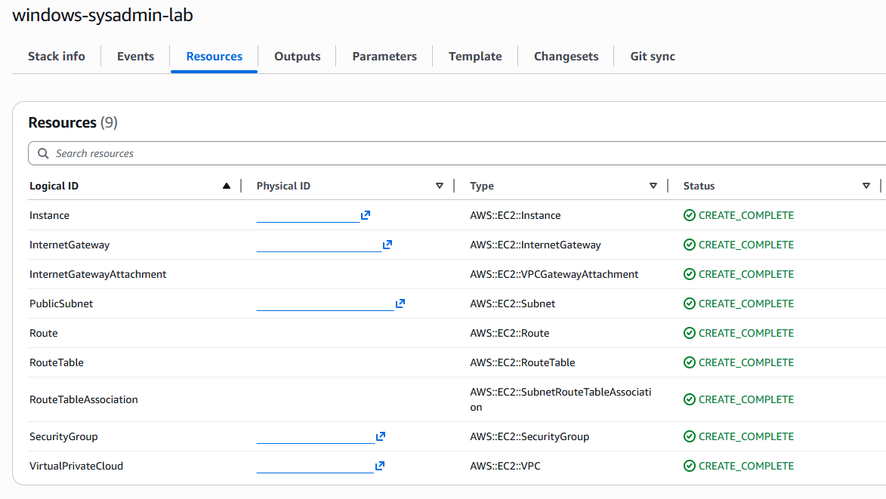
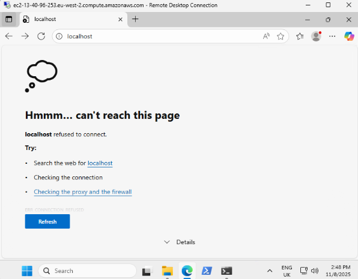
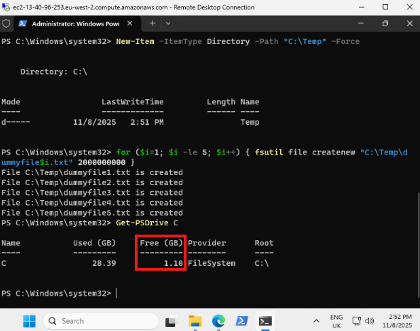
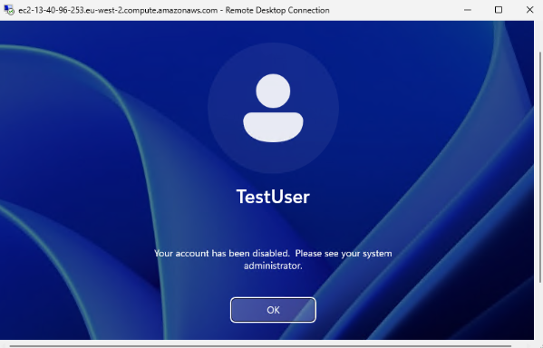

# Windows SysAdmin Lab (AWS EC2)

## Overview
Single-instance Windows Server 2025 EC2 lab demonstrating troubleshooting and automation.

## Architecture
- AWS EC2 t3.small instance
- Security Groups: RDP 3389, HTTP 80
- IIS installed and tested via public IP

## CloudFormation Deployment

You may also deploy this architecture using the [main.yaml](/infrastructure/main.yaml) template file in [/infrastructure](/infrastructure/).



Before deploying the stack, make sure to create a key pair so you can access the instance via RDP.

Once deployed, connect to the instance and configure the following:
- Update Windows
- Install IIS:
```
Install-WindowsFeature -name Web-Server -IncludeManagementTools
```
- Create Test Web Page:
```
Set-Content -Path "C:\inetpub\wwwroot\index.html" -Value "<h1>Windows Lab Server</h1><p>Healthy</p>"
```
- Verify Firewall:
```
netsh advfirewall firewall add rule name="Allow HTTP" dir=in action=allow protocol=TCP localport=80
```

**Make sure to delete the stack once finished to minimise costs.**

## Incidents Simulated
### Incident 1 - IIS Service Failure



**Symptoms:** HTTP site inaccessible  
**Diagnosis:** `Get-Service W3SVC` showed stopped  
**Resolution:** `Start-Service W3SVC`  
**Verification:** Site restored (`http://localhost`)  

### Incident 2 - Low Disk Space



**Symptoms:** Disk warning / files not saving  
**Diagnosis:** `Get-PSDrive C` showed < 5 GB free  
**Resolution:** Removed large files  
**Verification:** Disk usage normalised  

### Incident 3 - Disabled Account



**Symptoms:** Login failure for TestUser  
**Diagnosis:** `Get-LocalUser TestUser` → Disabled = True  
**Resolution:** `Enable-LocalUser TestUser`  
**Verification:** Login success  

## Automation
- `windows_iis_check.ps1` - Restarts IIS if stopped  
- `windows_disk_check.ps1` - Logs low-disk alerts  

### Optional scheduled scripts for hourly checks:
- `windows_scheduled_iis_check.ps1` - Restarts IIS if stopped  
- `windows_scheduled_disk_check.ps1` - Logs low-disk alerts  

## Skills Demonstrated
- Windows Server Administration & Troubleshooting  
- PowerShell Automation  
- AWS EC2 Management  
- Incident Diagnosis and Documentation
- CloudFormation Templating & Deployment  

## Next Steps
- Improve ReadMe instructions
- CloudWatch monitoring
- SNS alerting
